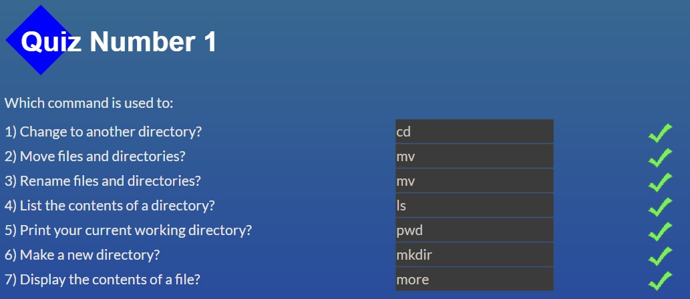
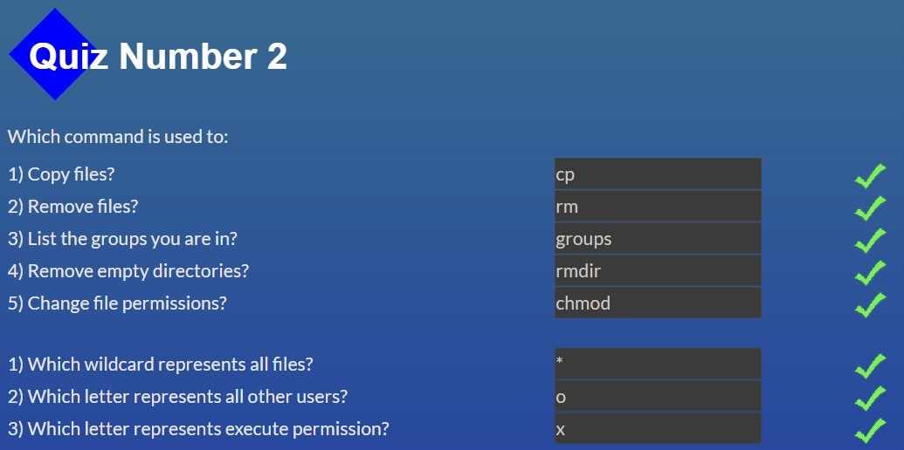
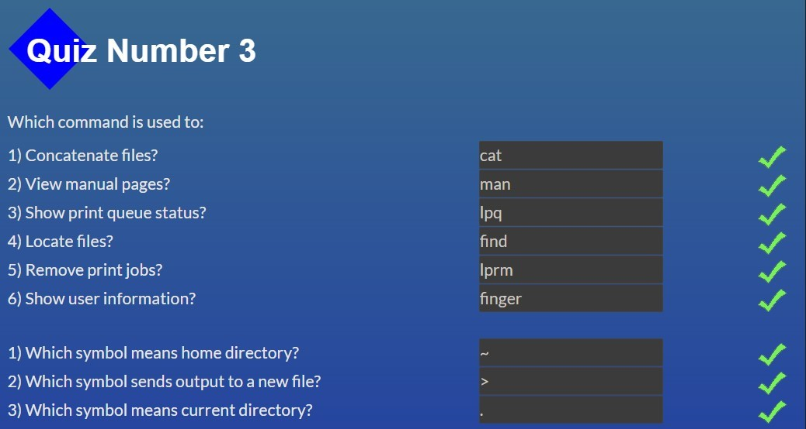
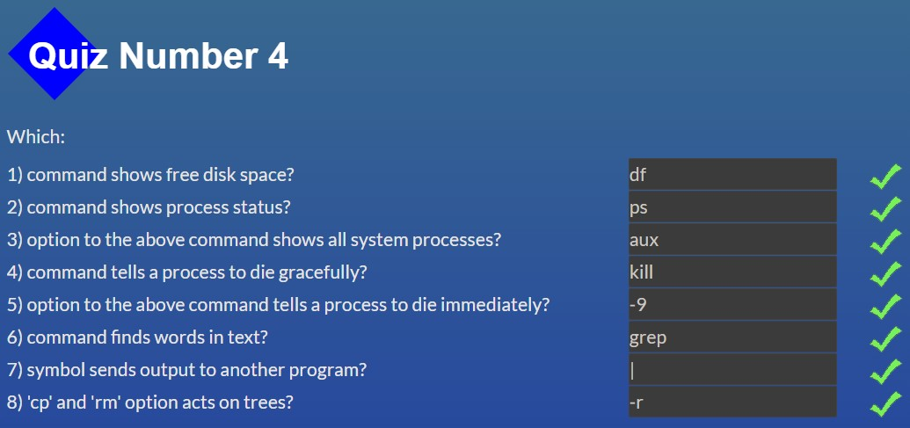

# kottans-frontend

# General

## 0. Git Basics

- [x] [Introduction to Git and GitHub](https://www.coursera.org/learn/introduction-git-github)

Week 1

Week 2

>Learned some new git commands as: git mv, git rm, git log --graph --oneline. The quiz at the end of each subtopic helped memorize and better understand the material.

- [x] [Learn Git Branching](https://learngitbranching.js.org/)

Introduction Sequence, Ramping Up

Push & Pull

>Learned some new git commands as: git fakeTeamwork.

## 1. Linux CLI, and HTTP

- [x] [Linux Survival (4 modules)](https://linuxsurvival.com/)

Module 1

Module 2

Module 3

Module 4

>Learned a lot of new commands. The most interesting part of the task for me was the 1st and 2nd module (working with files and directories). But another information was a little boring for me.
