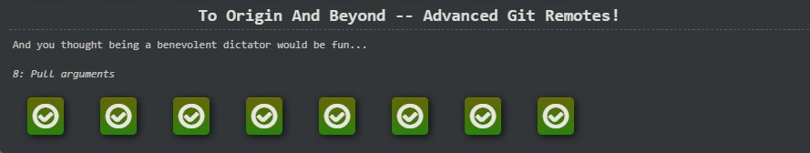

# kottans-frontend

# General

## 0. Git Basics

- [x] [Introduction to Git and GitHub](https://www.coursera.org/learn/introduction-git-github)

Week 1

Week 2

>Learned some new git commands as: git mv, git rm, git log --graph --oneline. The quiz at the end of each subtopic helped memorize and better understand the material.

- [x] [Learn Git Branching](https://learngitbranching.js.org/)

Introduction Sequence, Ramping Up

Push & Pull

>Learned some new git commands as: git fakeTeamwork.

## 1. Linux CLI, and HTTP

- [x] [Linux Survival (4 modules)](https://linuxsurvival.com/)

Module 1

Module 2

Module 3

Module 4

>Learned a lot of new commands. The most interesting part of the task for me was the 1st and 2nd module (working with files and directories). But another information was a little boring for me.

## 2. Git Collaboration

- [x] [Introduction to Git and GitHub](https://www.coursera.org/learn/introduction-git-github)

Week 3

>Learned new commands: git remote update.

Week 4

>Learned more about forks on GitHub, renaming and deleting commits with 'git rebase -i' command, force pushing, code reviews

- [x] [Learn Git Branching](https://learngitbranching.js.org/)

Moving Work Around

To Origin And Beyond

> Learned more about cherry-pick, rebase, push, pull and fetch.

## 3. Intro to HTML and CSS

- [x] [Intro to HTML & CSS](https://www.coursera.org/learn/html-css-javascript-for-web-developers)

Week 1

>I repeated the basics of HTML such as Basic HTML Document Structure, creating links, lists, displaying images.

Week 2

>Learned more about Pseudo-Class Selectors, Positioning Elements by Floating, Relative and Absolute Element Positioning, Responsive Design, Bootstrap.

- [x] [Learn HTML](https://www.codecademy.com/learn/learn-html)

Learn HTML

>Great practice and repetition of HTML. It is more convenient for me to perceive information in the form of text. Therefore, I liked this course more than the previous ones with videos and quizzes.

- [x] [Learn CSS](https://www.codecademy.com/learn/learn-css)

Learn CSS

>I really like [Learn HTML](https://www.codecademy.com/learn/learn-html) and [Learn CSS](https://www.codecademy.com/learn/learn-css) Courses. Now HTML and CSS seem much more easier and clearer for me. 

## 4. Responsive Web Design

- [x] [Flexbox Froggy](http://flexboxfroggy.com/)

Flexbox Froggy

>Nice game for flexbox practice. 

- [x] [Grid Garden](http://cssgridgarden.com/)

Grid Garden

>I like these games. It really helped me with grid and flexbox understanding.

## 5. HTML & CSS Practice

### [Demo](https://nkondd.github.io/HTML-CSS-Popup) | [Code Base](https://github.com/nkondd/HTML-CSS-Popup) | [PR](https://github.com/kottans/frontend-2022-homeworks/pull/427)

Screenshot

## 6. JavaScript Basics

- [x] [Introduction to JavaScript](https://www.coursera.org/learn/html-css-javascript-for-web-developers/home/week/4)

Introduction to JavaScript

>I learned a lot of new information about JavaScript.

- [x] [Basic JavaScript](https://www.freecodecamp.org/learn/javascript-algorithms-and-data-structures/basic-javascript/)

Basic JavaScript

>It was really hard, but now I know more different commands in JS and learn how to use it in practice. 

- [x] [ES6](https://www.freecodecamp.org/learn/javascript-algorithms-and-data-structures/es6/)

ES6

> I like ES6! This task was easier then previous one.

- [x] [Basic Data Structures](https://www.freecodecamp.org/learn/javascript-algorithms-and-data-structures/basic-data-structures/)

Basic Data Structures

- [x] [Basic Algorithm Scripting](https://www.freecodecamp.org/learn/javascript-algorithms-and-data-structures/basic-algorithm-scripting/)

Basic Algorithm Scripting

- [x] [Functional Programming](https://www.freecodecamp.org/learn/javascript-algorithms-and-data-structures/functional-programming/)

Functional Programming

- [x] [Algorithm Scripting Challenges](https://www.freecodecamp.org/learn/javascript-algorithms-and-data-structures/intermediate-algorithm-scripting/)

Algorithm Scripting Challenges

> It was too hard for me, so I used hints regularly. But it was really informative and useful, so now I know much more about JS.